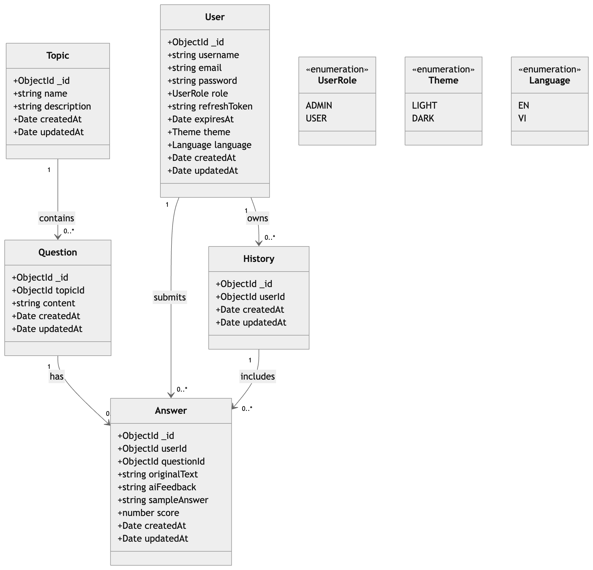
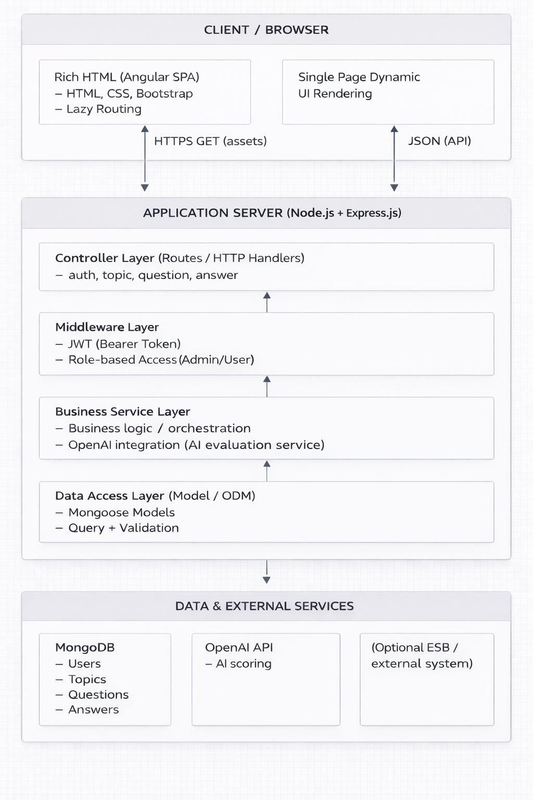
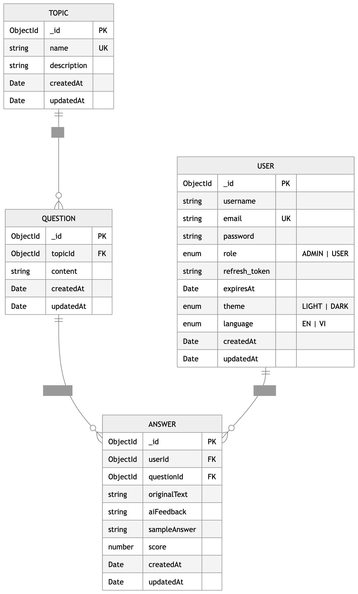

# Interview Practice Application

## 1. Problem Statement

This application helps learners practice interviews to improve their performance in real interviews.  
Users select a topic, receive interview questions, answer in text or voice, and then get evaluated by an AI system.

Core value of the system:
- Score each answer on a 0-100 scale.
- Provide detailed feedback so users can identify strengths and weaknesses.
- Suggest a high-quality sample answer to improve accuracy and completeness.
- Store practice history so users can track progress over time.

---

## 2. Requirements - Use Cases

### 2.1 Actors
- **Guest**: unauthenticated user.
- **User**: authenticated learner.
- **Admin**: content manager for topics/questions.
- **OpenAI Service**: external AI service for answer evaluation.

### 2.2 Main Functional Requirements / Use Cases

1. **Account Registration**
   - Guest creates a new account with `username`, `email`, and `password`.
   - System validates email uniqueness and stores a hashed password.

2. **Sign In and Session Management**
   - User signs in with email/password.
   - System issues `access token` and `refresh token`.
   - Refresh flow issues a new access token when needed.

3. **Interview Practice Flow**
   - User views the list of available topics.
   - User selects a topic and gets questions under that topic.
   - Frontend randomly picks one question for practice.
   - User answers via text or speech-to-text.

4. **AI-Based Evaluation**
   - User submits the current answer.
   - Backend calls OpenAI and receives JSON output containing `score`, `feedback`, and `sampleAnswer`.
   - Evaluation result is saved to answer history.

5. **Practice History**
   - User views all previous submitted answers (filtered by `userId`).

6. **Profile Update**
   - User updates UI preference (`theme`) and language (`language`).

7. **Content Management (Admin)**
   - Admin creates/updates/deletes topics.
   - Admin creates/updates/deletes questions by topic.

## 3. Domain Model Class Diagram

## 4. High-Level Architecture Diagram

## 5. ER Diagram (Database Design)

